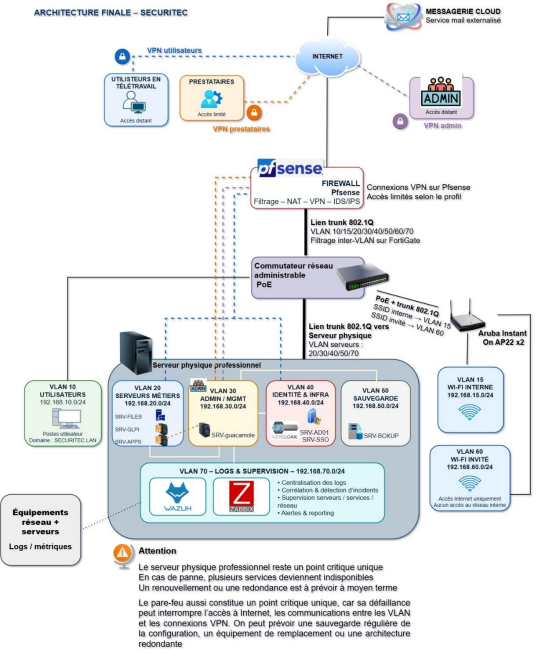
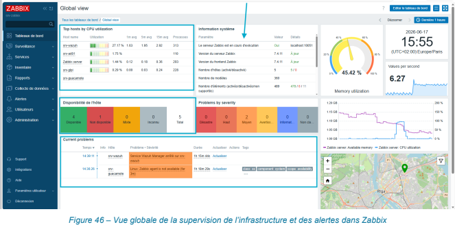
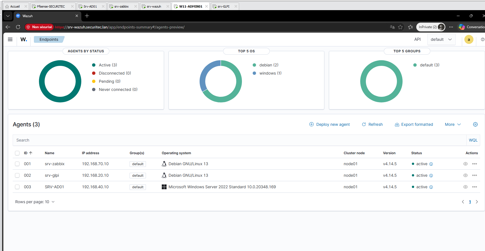
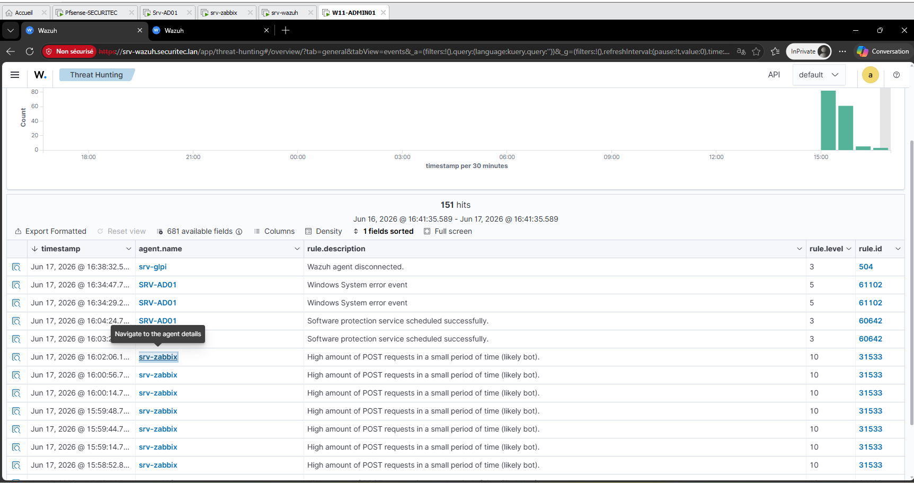
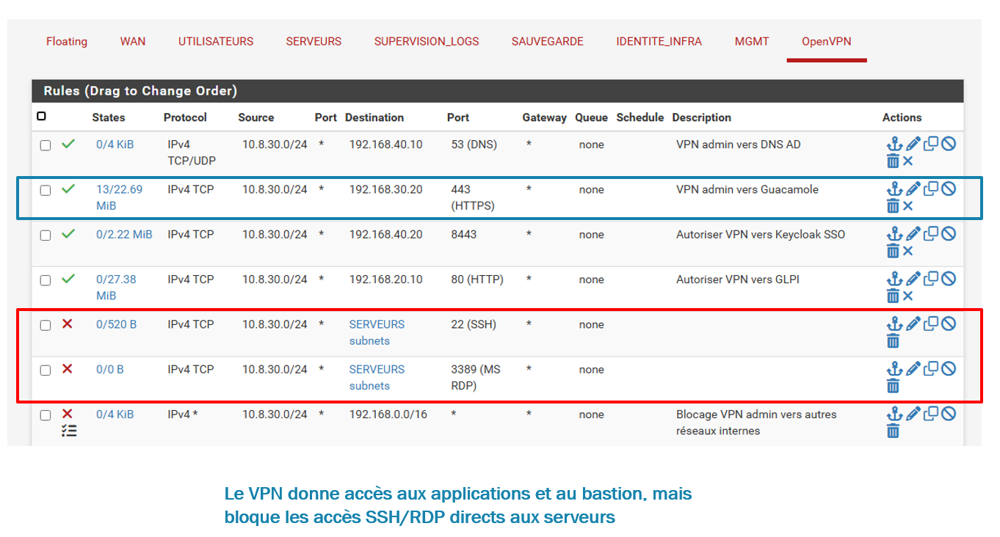
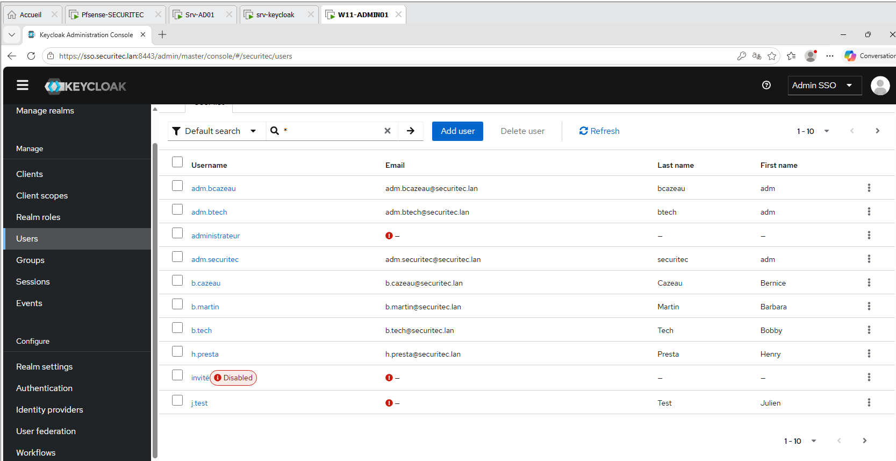
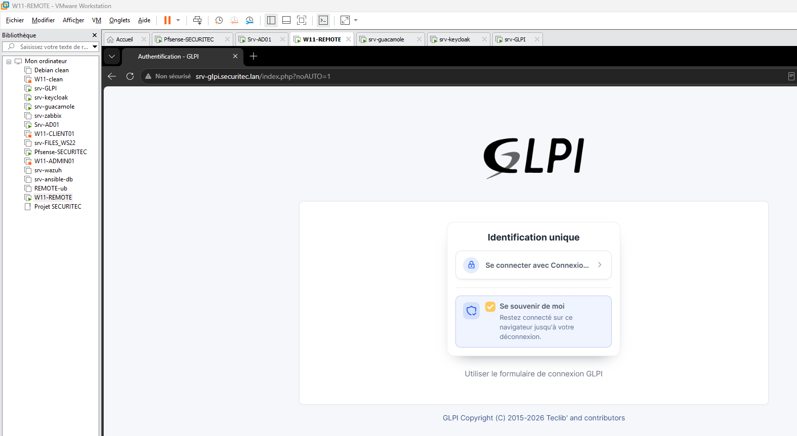
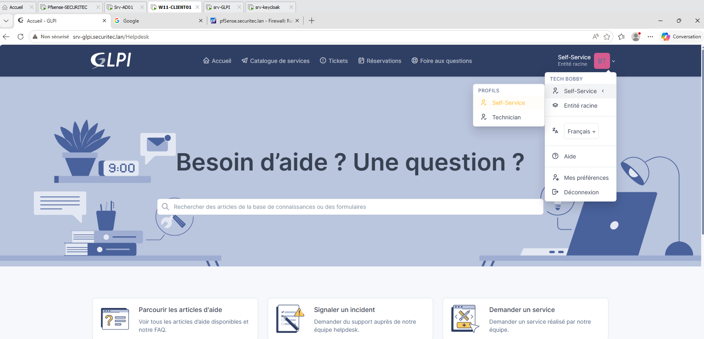
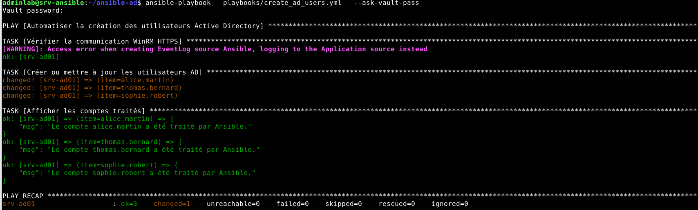

# 🏰 Forteresse Hybride — Homelab Infrastructure

Projet d'infrastructure personnel visant à reproduire, en conditions réelles, les briques techniques d'un environnement d'entreprise sécurisé : virtualisation, identités fédérées, accès distants, supervision et automatisation.

## 🎯 Contexte

Dans le cadre de ma reconversion vers l'administration Systèmes & Réseaux / DevOps, j'ai construit ce homelab pour mettre en pratique — au-delà de la théorie — la conception, le déploiement et la sécurisation d'une infrastructure hybride Windows/Linux.

## 🏗️ Architecture

- **Virtualisation** : VMware Workstation Pro — Windows Server 2022, Windows 11, Debian/Ubuntu/CentOS
- **Réseau** : pfSense (routage, NAT, VLAN, filtrage inter-VLAN), segmentation par zones (admin, utilisateurs, DMZ)
- **Identités** : Active Directory (DNS, GPO) fédéré avec **Keycloak** (LDAP, OpenID Connect, SSO, MFA/TOTP)
- **Accès distants sécurisés** : OpenVPN + bastion **Apache Guacamole** (accès RDP/SSH restreints et tracés)
- **Supervision** : **Zabbix** (hôtes, services) et **Wazuh** (centralisation des logs, détection d'anomalies)
- **Automatisation** : **Ansible** (playbooks YAML — création d'utilisateurs Active Directory, configuration système)
- **Support** : GLPI, intégré à Keycloak avec profils par groupes

*(schéma d'architecture à venir — voir dossier `/docs`)*

## 🔧 Ce que ce projet démontre

- Conception et sécurisation d'une infrastructure Windows/Linux de bout en bout
- Fédération d'identités et authentification unique (SSO) multi-facteurs
- Cloisonnement réseau et durcissement des accès distants
- Mise en place d'une chaîne de supervision et de détection d'incidents
- Automatisation des tâches d'administration avec Ansible

## 📁 Structure du dépôt

```
├── ansible/ → playbooks et rôles
├── network/ → configurations pfSense (exports, schémas VLAN)
├── docs/ → schémas d'architecture, documentation
├── screenshots/ → captures Zabbix, Wazuh, Keycloak, GLPI
└── README.md
```

## 🖼️ Aperçu

### 🗺️ Architecture


*Schéma de l'architecture finale : segmentation VLAN, flux entre zones, accès distants et points de vigilance.*

### 📡 Supervision


*Vue globale de la supervision de l'infrastructure et des alertes dans Zabbix.*

### 🛡️ Sécurité


*Agents actifs supervisés depuis la console centralisée Wazuh.*


*Centralisation et analyse des événements de sécurité provenant de plusieurs serveurs.*


*Le VPN donne accès aux applications et au bastion, mais bloque les accès SSH/RDP directs aux serveurs.*

### 🔐 Identités & accès


*Gestion centralisée des comptes et des rôles via Keycloak.*


*Authentification unique (SSO) entre GLPI et Keycloak.*


*Portail helpdesk GLPI avec gestion des profils par groupe (Self-Service / Technicien).*

### ⚙️ Automatisation


*Exécution d'un playbook Ansible créant automatiquement des comptes utilisateurs dans Active Directory.*

## 🧑‍💻 Auteure

**Marie Bernice Cazeau** — Administratrice Systèmes & Réseaux — DevOps
[LinkedIn](https://www.linkedin.com/in/bernicesc)

## 📄 Licence

Ce projet est sous licence MIT — voir le fichier [LICENSE](./LICENSE).
